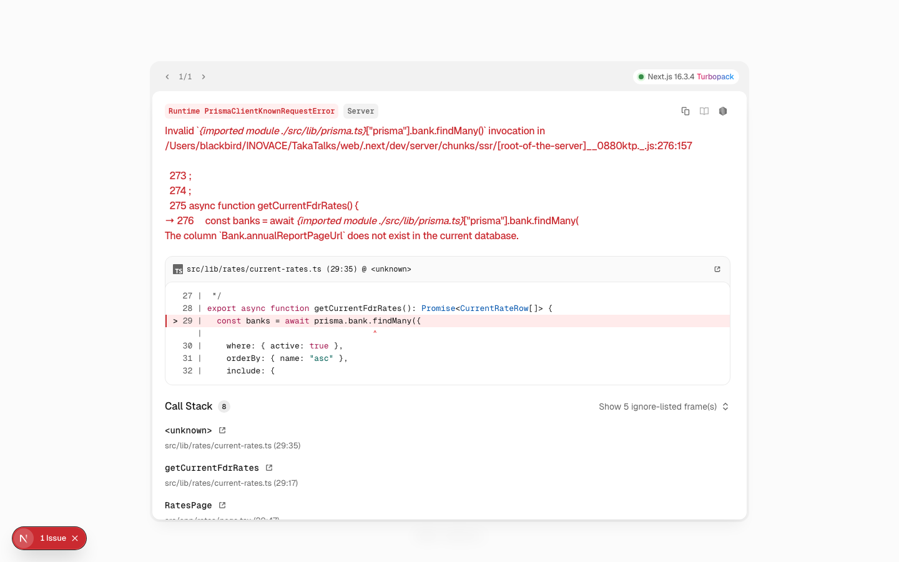
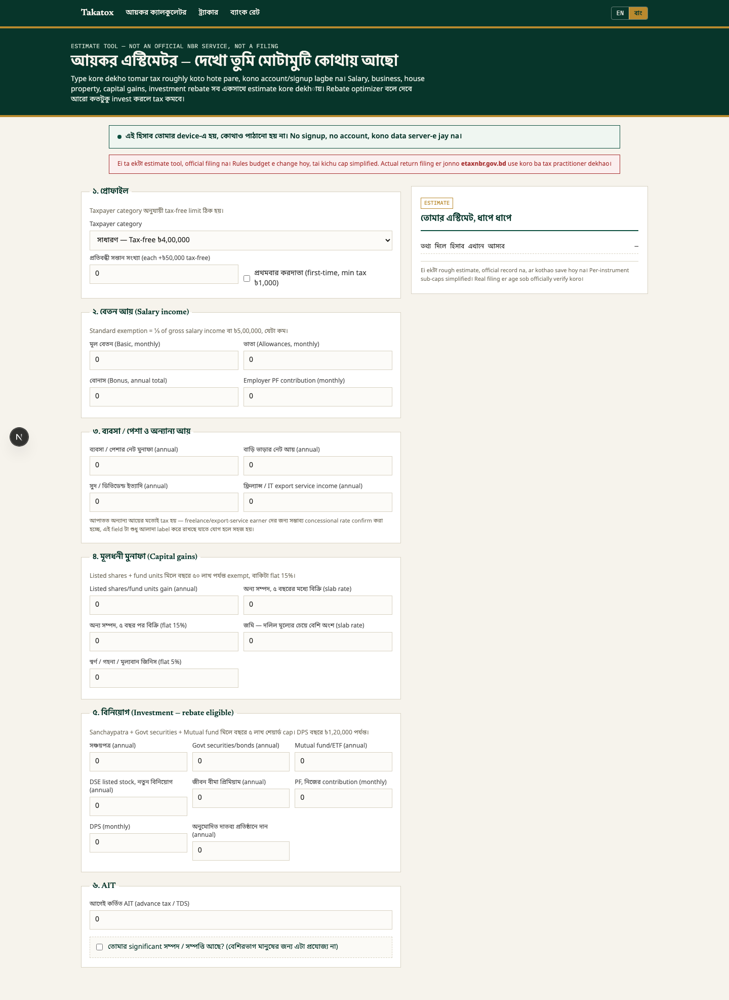
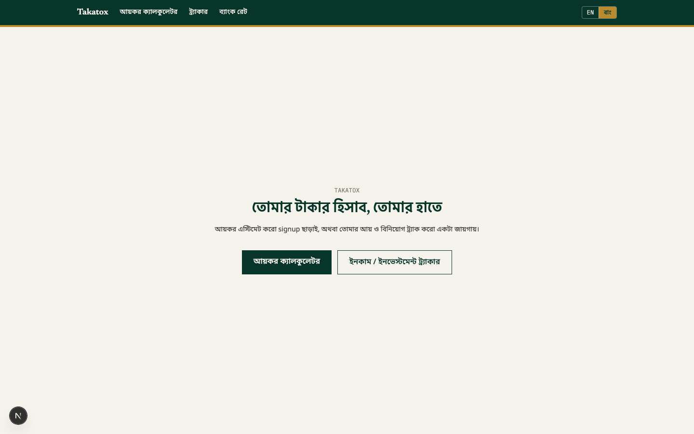
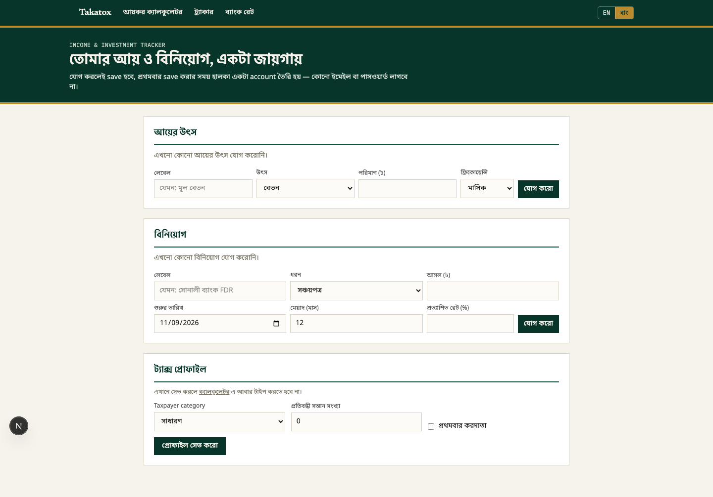

# Takatox — UI/UX critique

**Method:** ran the app locally (`npm run dev`), screenshotted every page at desktop
(1440×900) and mobile (390×844) with Playwright, read the component source for the
flows that couldn't fully render, and scored what I found against [Jakob Nielsen's 10
usability heuristics](https://www.nngroup.com/articles/ten-usability-heuristics/) (NN/g),
the industry-standard heuristic-evaluation checklist. Findings are ordered by severity;
each cites the file/line or screenshot it's based on.

Context pulled from `docs/product-notes.md` and `docs/feature-spec-tax-calculator.md`
informed a few calls below — e.g. the deliberately low-stakes "estimate" framing and the
"no verdict, just sourced data" stance on bank comparisons are intentional product
decisions, not oversights, and are called out as strengths rather than flagged.

---

## High severity

### 1. Two core pages currently crash — `/rates` and `/admin/setup`
Both hit an unhandled `PrismaClientKnownRequestError` and fall through to the raw Next.js
dev error overlay instead of the app's UI:



Root cause: `prisma migrate status` shows 3 pending migrations against the configured
Postgres datasource, and the schema has drifted (e.g. `Bank.annualReportPageUrl` doesn't
exist in the current DB). Separately, `web/prisma/dev.db` sits **untracked in git and
unused** — the active datasource is Postgres per `.env`, so that file is dead leftover
from an earlier setup and doesn't explain or fix the drift.

- **Heuristic violated:** #1 Visibility of system status / #9 Help users recognize,
  diagnose, and recover from errors. In production this dev overlay won't show, but
  whatever *does* render (a generic 500) still gives a user zero path back to a working
  state on two primary nav items ("Bank Rates" is a top-level nav link).
- **Fix:** run `prisma migrate deploy` (or `dev`) against the real datasource before any
  demo/review, delete or `.gitignore` the stray `dev.db`, and add an error boundary
  (`error.tsx`) under `app/rates/` and `app/admin/` so a real failure degrades to a
  branded, explained state instead of a stack trace.

### 2. Deleting an income or investment entry is instant, with no confirmation or undo
```tsx
// IncomeSection.tsx:89 / InvestmentSection.tsx:116
onClick={() => onDelete(e.id)}
```
One click permanently removes a financial record — no "are you sure," no toast with an
undo, nothing.

- **Heuristic violated:** #3 User control and freedom, #5 Error prevention. This is
  exactly the class of action (destructive, hard to reverse, on data the user manually
  typed in) that heuristic evaluation calls out first.
- **Fix:** a lightweight inline confirm ("Delete? [Yes] [Cancel]") or a 5-second
  undo toast is enough — doesn't need a modal.

### 3. Mobile nav wraps into a ragged, uneven header
At 390px width, the Bengali labels don't fit the flex row and wrap inconsistently — no
hamburger/responsive treatment exists in `SiteNav.tsx`:


- **Heuristic violated:** #4 Consistency and standards, #8 Aesthetic and minimalist
  design. This is the first thing every mobile visitor sees, on every page.
- **Fix:** collapse to a hamburger/sheet under a breakpoint, or shorten the Bengali nav
  labels so they fit one line at 360–390px (the most common Android viewport width in
  Bangladesh).

---

## Medium severity

### 4. Translation coverage has silent gaps in the calculator
Every other field in `CalculatorForm.tsx` goes through `t(en, bn)`, but these are
hardcoded English-only:

- `CalculatorForm.tsx:42` — "Taxpayer category"
- `CalculatorForm.tsx:79` — "Employer PF contribution (monthly)"
- `CalculatorForm.tsx:121` — "Listed shares/fund units gain (annual)"
- `CalculatorForm.tsx:150–151` — "Govt securities/bonds (annual)", "Mutual fund/ETF (annual)"
- `CalculatorForm.tsx:161` — "DPS (monthly)"

The app's whole pitch is "speaks your language" (the EN/বাং toggle is front and center in
the nav). A user who switches to বাং and hits one of these fields gets an unexplained
language switch mid-form.

- **Heuristic violated:** #2 Match between system and the real world, #4 Consistency.
- **Fix:** grep for `label="` without an adjacent `t(` call (the command I used:
  `grep -n 'label="[A-Za-z]' *.tsx | grep -v 't('`) and wrap the rest.

### 5. Money fields fight the user's mental model of money
Every amount field (`fields.tsx` `NumberField`, plus the calculator/tracker forms) is a
native `<input type="number">` defaulting to a literal `0`:



For a Bangladeshi audience that thinks in lakhs/crores, this means: no thousand/lakh
grouping as you type, no ৳ affix inside the field (only in the label), and browser
spinner arrows that are meaningless for a salary figure. On the calculator page alone
there are ~20 such fields, each requiring a select-and-clear of "0" before typing.
- **Heuristic violated:** #6 Recognition rather than recall (harder to sanity-check a
  7-digit unformatted number at a glance), #8 minimalist design (spinner-arrow clutter).
- **Fix:** a formatted numeric input (comma-groups on blur, or an `im-mask`-style
  as-you-type formatter) with the currency symbol inside the field, and an empty
  placeholder instead of a real `0` value.

### 6. Focus states are easy to lose on dense forms
`fields.tsx` and friends use `focus:outline-none focus:border-green` — the native focus
ring is removed and replaced with only a 1px border-color change. On a page with 20+
visually identical bordered inputs, that's a subtle signal to track while tabbing.
- **Risk:** WCAG 2.4.7 (Focus Visible) — worth a real check with a keyboard, not just a
  code read.
- **Fix:** add a visible focus ring/shadow in addition to the border-color change.

### 7. Homepage is mostly empty space
`app/page.tsx` centers the hero in a full-height flex column with nothing else on the
page (no footer, no secondary content):



On any viewport taller than ~500px this leaves large dead margins above and below a
four-line hero — the kind of gap that reads as "unfinished" to a first-time visitor
before they've formed any opinion about the product itself.
- **Heuristic violated:** #8 Aesthetic and minimalist design (imbalance, not clutter).
- **Fix:** either accept a shorter centered hero (reduce vertical space intentionally)
  or add a lightweight second section (how it works / the three tools) so the page fills
  more deliberately.

### 8. Unbalanced two-column layout on the calculator page
The right-hand "your estimate" sidebar is a few lines of text next to a very long
left-hand form — once the estimate panel's content is short, most of that column is
blank while the left column keeps scrolling:



- **Fix:** either make the summary panel `sticky` so it travels with the user down the
  long form (likely the actual intent, given the "step by step" framing), or drop to a
  single column and move the summary to the top/bottom.

---

## Low severity / notes

- **Admin login (`AdminLoginForm.tsx`) is English-only** with no bilingual treatment,
  unlike literally every other user-facing screen. Probably fine since it's
  internal-only, but flagging in case non-technical local admins ever use it.
- **No loading state** on the two server-rendered data pages (`rates`, `admin/*`) — both
  are `force-dynamic` with no `loading.tsx`/`Suspense` boundary, so a slow DB round-trip
  shows a blank page rather than a skeleton.
- The stray `web/prisma/dev.db` (see High #1) is also just confusing repo hygiene:
  nothing references it, it's not gitignored, and it invites a future contributor to
  wonder whether it's the real dev database.

---

## What's working well (worth protecting, not "fixing")

- **Real-time calculators, no submit button.** Both `CalculatorForm` and `RateScorecard`
  recompute on every keystroke via `useMemo` — textbook heuristic #1 (visibility of
  system status): the user never wonders "did that update?"
- **Validation errors are plain-language and bilingual**, e.g. `IncomeSection.tsx`:
  *"Amount must be a number greater than zero." / "পরিমাণ অবশ্যই শূন্যের চেয়ে বড় একটা
  সংখ্যা হতে হবে।"* — no error codes, precise, matches heuristic #9 exactly.
- **The bank-rate comparison deliberately refuses to rank or badge a "best" bank** —
  sort is presented as "just for convenience, not a verdict," and every row carries its
  source, method (manual/scraped), and an explicit *"unverified since [date]"* flag when
  stale. Given the regulatory sensitivity called out in `docs/product-notes.md` (this is
  BSEC-adjacent territory), this restraint is a real strength, not a missing feature.
- **The deposit-insurance disclaimer on the rates page is permanent and
  non-dismissible** by design (per the code comment) — appropriate given the stakes.
- **Accessibility groundwork is already in place**: every field uses `useId()` +
  `htmlFor` (not just placeholder-as-label), and the language toggle has
  `role="group"`, `aria-label`, and `aria-pressed` — better baseline than most apps this
  size bother with.

---

## If I had to pick three to fix first
1. Get `/rates` and `/admin/setup` actually loading (High #1) — everything else about
   those pages is currently unreviewable because they crash.
2. Add a delete confirmation/undo in the tracker (High #2) — real financial data, zero
   safety net.
3. Fix the mobile nav wrap (High #3) — cheapest fix on this list, highest visibility.
