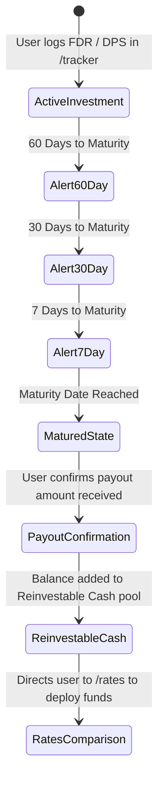

# Maturity & Reinvestment Lifecycle Agent

The **Maturity & Reinvestment Lifecycle Agent** powers the post-calculation retention layer of TakaTalks, specifically supporting the **Income & Investment Tracker** (`takatalks.com/tracker`) and eliminating the *"Lazy Money Leak"*.

---

## 1. The Core Problem: The "Lazy Money Leak"

In Bangladesh, depositors frequently face this scenario:
1. An individual deposits ৳3,00,000 in a 1-year Fixed Deposit (FDR) at 10.5%.
2. After 12 months, the FDR matures and the principal + interest is credited to their regular savings or current account.
3. The individual forgets the exact maturity date, receives no clear bank notification, or is busy with work.
4. The money sits in the savings account for 4 to 8 months earning a meager 2.0% – 3.0% interest (or 0% in a current account), suffering severe purchasing power erosion against ~9-10% inflation.

The Lifecycle Agent prevents this loss by running automated maturity countdowns and nudging the user to take action.

---

## 2. Retention Philosophy: Frictionless & Respectful

- **No Spam**: The agent only messages when an actual financial event occurs (an investment is maturing or has matured).
- **Lightweight Opt-in**: As documented in [`docs/feature-spec-tax-calculator.md`](file:///Users/blackbird/INOVACE/TakaTalks/docs/feature-spec-tax-calculator.md), users are only asked for an email or WhatsApp contact at the exact moment they configure an alert:
  > *"Want us to remind you when this ৳2,00,000 FDR matures? We'll only save this contact to send you maturity alerts."*
- **Multi-Channel Delivery**: Supports Email and WhatsApp notifications (leveraging existing WhatsApp delivery infrastructure used by Tipsoi).

---

## 3. Lifecycle State Machine

