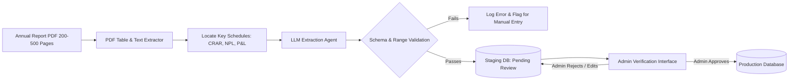

# Bank Annual Report Extraction Agent

The **Bank Annual Report Extraction Agent** is a specialized background processing pipeline responsible for extracting audited financial health indicators (Capital Adequacy, Non-Performing Loans, Provisions, ROA) from commercial banks' official annual report PDFs, adhering to [`prompts/03-annual-report-extraction.md`](file:///Users/blackbird/INOVACE/TakaTalks/prompts/03-annual-report-extraction.md).

---

## 1. The High-Stakes Context in Bangladesh

Extracting and displaying bank health indicators is high-stakes in Bangladesh:
- **Banking Sector Stress**: According to Bangladesh Bank stability reports, aggregate CRAR (Capital to Risk-Weighted Assets Ratio) has turned negative for parts of the sector, with gross NPLs exceeding 30–32% across multiple institutions.
- **Deposit Insurance Limit**: Under the **Deposit Protection Act 2026**, deposit insurance is capped at **BDT 2,00,000 per depositor per bank**, and only triggers upon formal court liquidation.
- **Reporting Discrepancies**: Weak banks historically concealed default loans or provision shortfalls through regulatory forbearance. Audited figures often contrast sharply with marketing claims.

### Absolute Ground Rule:
> **No automated data reaches production without a human admin approval step.** The agent extracts, normalizes, attaches source page snippets, and queues the figures into an internal staging dashboard.

---

## 2. Processing Pipeline Workflow

---

## 3. Key Financial Metrics Extracted

The agent extracts the following audited indicators (Solo and Consolidated):

| Metric | Full Name / Description | Minimum Regulatory Benchmark (BB) |
|---|---|---|
| **CRAR / CAR** | Capital to Risk-Weighted Asset Ratio | Min 12.50% (Basel III requirement) |
| **Tier 1 Capital Ratio** | Core Equity Capital Ratio | Min 8.50% |
| **Gross NPL Ratio** | Non-Performing Loans / Total Advances | Benchmark < 5.0% for commercial banks |
| **Provision Shortfall** | Actual Provisions vs Required Provisions | BDT Crore (Zero shortfall required) |
| **ROA** | Return on Assets | Net Profit / Total Assets |
| **ROE** | Return on Equity | Net Profit / Shareholders' Equity |
| **Auditor Name** | Independent Chartered Accountancy Firm | Must be BSEC/BB approved auditor |
| **Audit Opinion** | Unqualified, Qualified, or Adverse | Indicator of accounting integrity |

---

## 4. Cadence & Triggers

- **Annual Run (April – July)**: Banks in Bangladesh operate on a January–December fiscal year (calendar year). Annual audited reports are published between April and June following AGMs.
- **Quarterly Unaudited Statements (May, August, November)**: Unaudited quarterly reports are checked for dramatic shifts in NPL or capital ratios.
