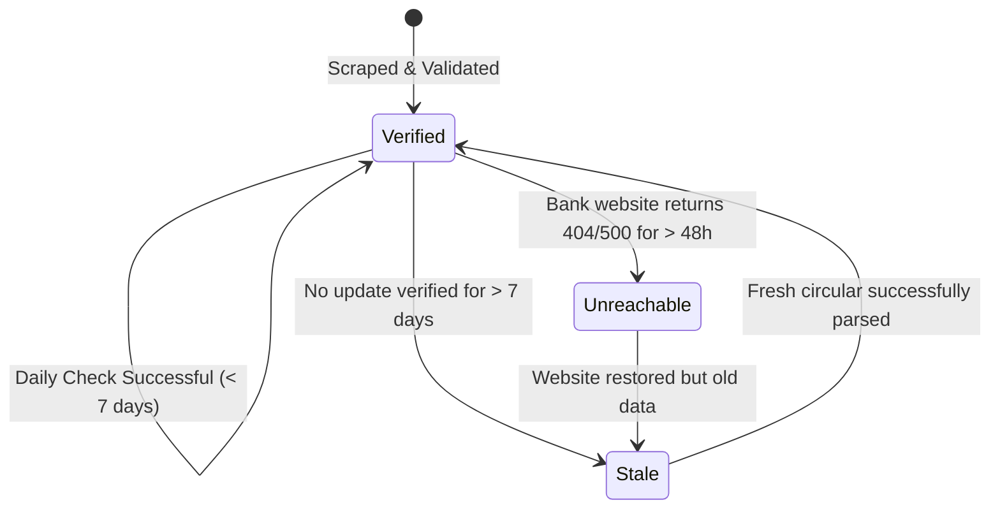

# Rate Sentinel: Scraping & Pipeline Specification

This document details the target banks, endpoints, extraction selectors, and parsing logic used by the **Rate Sentinel Agent** to track deposit rates in Bangladesh.

---

## 1. Monitored Commercial Banks & Targets

The agent targets representative private commercial banks, Islamic banks, state-owned banks, and foreign multinational banks to give a balanced, realistic market view.

| Bank Code | Bank Name | Primary Data Source URL | Format | Expected Tenors |
|---|---|---|---|---|
| `BRAC` | BRAC Bank PLC | `https://www.bracbank.com/en/retail/term-deposit` | HTML Table / PDF | 3M, 6M, 1Y, 3Y |
| `CITY` | City Bank PLC | `https://www.thecitybank.com/retail/deposit/fdr` | HTML DOM | 3M, 6M, 1Y |
| `EBL` | Eastern Bank PLC | `https://www.ebl.com.bd/retail/term-deposit` | HTML Cards | 3M, 6M, 1Y, 2Y |
| `SCB` | Standard Chartered Bangladesh | `https://www.sc.com/bd/deposits/fixed-deposit/` | HTML Accordion | 3M, 6M, 1Y |
| `DBBL` | Dutch-Bangla Bank | `https://www.dutchbanglabank.com/electronic-banking/fdr.html` | HTML Table | 3M, 6M, 1Y, 3Y |
| `IBBL` | Islami Bank Bangladesh PLC | `https://www.islamibankbd.com/deposit/mudaraba_term.php` | HTML Table (Mudaraba Provisional) | 3M, 6M, 1Y, 3Y |
| `SONALI`| Sonali Bank PLC (State-Owned) | `https://www.sonalibank.com.bd/interest_rate.php` | PDF Circular | 3M, 6M, 1Y, 3Y |
| `BB` | Bangladesh Bank (Central Bank) | `https://www.bb.org.bd/en/index.php/financialactivity/interestrate` | Statistical Table | Weighted Avg Deposit Rate |

---

## 2. Scraping & Parsing Logic

### A. Dynamic & Static Fetching Strategy
- **Standard HTML Sources**: Use lightweight HTTP fetch via `undici` or `fetch` with realistic browser headers (`User-Agent: Mozilla/5.0...`).
- **Client-Rendered (SPA) Sources**: If a bank's rates are hydrated via JavaScript, launch headless Playwright with resource blocking (block images, fonts, analytics) to minimize compute overhead.
- **PDF Circulars**: When a bank publishes rates only via scanned or text PDFs (common with state-owned banks and sudden rate revisions):
  1. Download PDF to a temp storage buffer.
  2. Extract raw text using `pdf-parse` or structured OCR.
  3. Locate keywords: *"Interest Rate on Fixed Deposits"*, *"Individual / Retail"*, *"1 Year & Above"*.
  4. Match regex patterns: `/(?:1\s*Year|12\s*Months|১\s*বছর)[\s\S]{1,40}?(\d{1,2}(?:\.\d{1,2})?)\s*%/i`.

### B. Islamic Banking (Mudaraba) Special Rule
- For Islamic banks (IBBL, Al-Arafah, City Islamic), rates are legally **provisional weightages** or profit-sharing ratios based on past actual yields, rather than fixed interest.
- The scraper must extract the rate with the flag `is_provisional: true` and display a clear tooltip: *"Provisional expected profit rate based on previous month declaration"*.

---

## 3. Staleness Detection & State Transitions

Every monitored rate transitions through 3 states:

### Staleness Criteria:
- **`FRESH` (`verifiedAt <= 3 days`)**: Shown with a green checkmark: *"Verified on DD MMM YYYY"*.
- **`WARNING` (`3 days < verifiedAt <= 7 days`)**: Shown with a neutral grey tag: *"Verified X days ago"*.
- **`STALE` (`verifiedAt > 7 days`)**: Shown with a warning badge: *"⚠️ Rate not re-verified recently. Bank may have revised circular."*

---

## 4. Anomaly Detection & Circuit Breakers

To prevent scraper bugs or website typos from corrupting public data:
1. **Absolute Hard Bounds**: Any parsed rate `< 3.0%` or `> 16.0%` triggers an immediate validation failure and is rejected.
2. **Delta Threshold**: If a newly parsed rate changes by more than `2.0%` (200 basis points) compared to the current database rate, do NOT auto-publish. 
   - Move to `StagingRate` table with flag `NEEDS_HUMAN_REVIEW`.
   - Send an immediate Slack / Webhook alert to the dev team.
