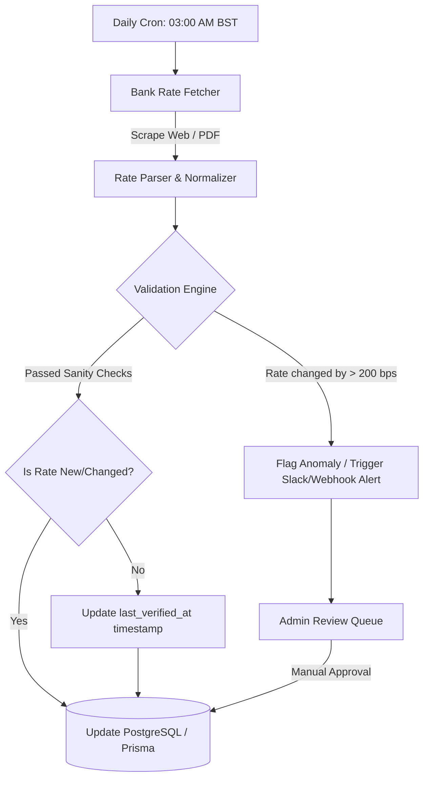

# Bank Rate Sentinel Agent

The **Bank Rate Sentinel Agent** is an automated data pipeline and monitoring agent responsible for maintaining the accuracy, freshness, and credibility of commercial bank FDR (Fixed Deposit Receipt) and DPS rates displayed on TakaTalks (`takatalks.com/rates`).

---

## 1. Core Mandate & Non-Negotiable Rules

From the repository's foundational architecture:
1. **Never Silently Show Stale Data**: Every published rate MUST have an explicit `source_url`, `last_verified_at` timestamp, and verification status. If a bank changes its page or a rate cannot be verified within 7 days, it is visually flagged as stale.
2. **Never Issue a "Best Bank" Verdict**: The agent NEVER ranks banks by a composite "health" or "recommendation" score. It extracts transparent, sourced numbers and calculates mathematical after-tax net returns, leaving the decision to the user.
3. **Audit Trail**: Every scrape or manual rate adjustment is recorded in an immutable log (`RateAuditLog`) with before/after diffs and raw HTML/PDF snapshots.

---

## 2. Agent Architecture & Execution Model



### Execution Cadence:
- **Daily Scrape (03:00 AM BST)**: Routine fetch of published HTML circulars and bank deposit pages.
- **Weekly Deep Audit (Sundays 06:00 AM BST)**: Inspects quarterly deposit rate schedules (PDFs) and Bangladesh Bank aggregate sector rates.
- **Staleness Monitor (Hourly)**: Scans the database for entries where `last_verified_at > 7 days` and marks `is_stale = true`.

---

## 3. Database Schema Integration (Prisma)

The agent populates and updates the following models in `prisma/schema.prisma`:

```prisma
model BankRate {
  id              String       @id @default(cuid())
  bankName        String       // e.g., "BRAC Bank PLC"
  bankCode        String       // e.g., "BRAC"
  instrumentType  String       // "FDR" | "DPS"
  tenorMonths     Int          // e.g., 3, 6, 12, 36
  headlineRate    Float        // e.g., 10.5 (%)
  compoundingFreq String       // "monthly" | "quarterly" | "maturity"
  minDeposit      Float?       // e.g., 50000
  sourceUrl       String
  sourceType      String       // "html" | "pdf_circular"
  verifiedAt      DateTime     @default(now())
  isStale         Boolean      @default(false)
  effectiveDate   DateTime?
  rawSnapshotHash String?
  history         BankRateLog[]
}

model BankRateLog {
  id         String   @id @default(cuid())
  bankRateId String
  oldRate    Float
  newRate    Float
  changedAt  DateTime @default(now())
  reason     String?
  bankRate   BankRate @relation(fields: [bankRateId], references: [id], onDelete: Cascade)
}
```

---

## 4. Operational Checklist for the Agent

- [ ] Fetch HTML/PDF from monitored banks.
- [ ] Parse interest rates for standard tenors: 3-month, 6-month, 1-year, 3-year.
- [ ] Query Bangladesh Bank's latest monthly **Weighted Average Deposit Rate** (`bb_aggregate_rate`).
- [ ] Verify rate sanity (Rate must be between 3.0% and 16.0%).
- [ ] Check rate variance from previous value (flag if change > 2.0% in a single update).
- [ ] Update `verifiedAt` timestamp for unchanged rates.
- [ ] Push changed rates into the active database or staging queue.
