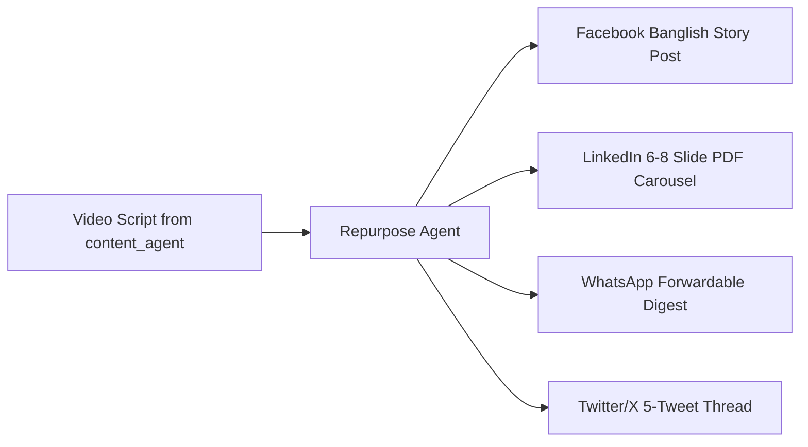

# Multi-Platform Content Repurposing Agent

The **Multi-Platform Content Repurposing Agent** takes video scripts, walkthroughs, and financial guides produced by the `content_agent` and automatically adapts them into high-performing text and visual formats across **Facebook, LinkedIn, WhatsApp, and Twitter/X**.

---

## 1. Why Repurposing Matters in Bangladesh

While video (Reels, TikTok, YouTube) builds awareness, **Facebook text posts, LinkedIn carousels, and WhatsApp groups** are where Bangladeshi professionals and families actually read, bookmark, share, and discuss personal finance decisions:

1. **Facebook Pages & Groups**: Long-form Banglish posts with relatable storytelling and clean line-breaks get shared heavily into family, university alumni, and professional groups (e.g. *Tech Masters Bangladesh*, *Freelancers Hub*, *Dhaka University Alumni*).
2. **LinkedIn**: Mid-level to senior executives (MNCs, local conglomerates, fintech engineers) prefer concise, visually clean multi-slide PDF carousels explaining tax exemptions or executive salary structures.
3. **WhatsApp Communities**: High-trust, zero-spam bulleted summaries that people forward to parents, relatives, or office colleagues before tax filing or bank FDR placements.

---

## 2. Inputs & Generated Output Formats

### Output Artifacts Generated for Each Video Topic:
- `facebook_post.txt`: Formatted with hook, body, clean spacing, and pinned comment suggestion.
- `linkedin_carousel_slides.md`: Slide-by-slide copy ready for Canva, Figma, or automated HTML-to-PDF rendering.
- `whatsapp_digest.txt`: Compact, bolded bullet points with a zero-signup direct link to `takatalks.com`.
- `twitter_thread.txt`: 4-6 concise tweets dissecting the financial math.
